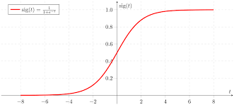

# Linear Models (Supervised Learning)

 - [Linear Models (Supervised Learning)](#linear-models-supervised-learning)
  - [Regression](#regression)
    - [Ordinary Least Squares (OLS, or Linear Regression)](#ordinary-least-squares-ols-or-linear-regression)
    - [Ridge regression (or Tikhonov, or L2 regularization)](#ridge-regression-or-tikhonov-or-l2-regularization)
    - [Least Absolute Shrinkage and Selection Operator (Lasso, or L1 regularization)](#least-absolute-shrinkage-and-selection-operator-lasso-or-l1-regularization)
  - [Classification](#classification)

It is easier to start the Linear Models with regression, since classification uses the same concepts.

## Regression

Assume a **dataset** formed of **$m$ features** ($f_0, f_1, ... , f_m$) and **$n$ observations** ($x_i = x_{i0}, x_{i1}, ... , x_{im}$; with $1 \leq i \leq n$), each with a **target value** (i.e., $y_0, y_1, ..., y_i, ... y_n$). 

If we have $m \leq n$, then linear models will fully map the dataset. Why? Because linear models will try to fit a system of linear equations that we can exactly solve. Otherwise, we will find the best fit; i.e., the one that minimizes a _loss_.

These equations look as follow: $y_i = w_0 \cdot x_{i0} + w_1 \cdot x_{i1} + ... + w_m \cdot x_{im} + e_i$.

We call $W$ the matrix of all weights (coefficients), of shape $m \times 1$; $X$ the dataset, of shape $n \times m$ ; and $Y$ the matrix of target values, of size $n \times 1$; and $e_i$ the random noise (a.k.a. error, slack, etc.)

In linear models, what we call "_learn_" is simply solving the system. We have different options as we will see next.

### Ordinary Least Squares (OLS, or Linear Regression)

Least squares is simple. It fits $W = (X^T · X)^{-1} · X^T · Y$; where all elements are matrices; $^T$ and $^{-1}$ are the transpose and invert operators, respectively. This expression is the unique solution that comes from minimizing the objective function (a.k.a. _loss function_):

$L = \sum_{i=1}^{n} (y_i - x_i \cdot W)^2 = \left\Vert\ Y - X \cdot W \right\Vert_{2}^{2}$. This is, minimizing the difference between the actual target value and the prediction.

### Ridge regression (or Tikhonov, or L2 regularization)

The main "problem" with OLS is that it overfits the dataset. Also, OLS is not defined when $m > n$. Ridge regression attempts to solve that by adding a penalization term $\lambda \in [0, 1]$.

In short, it changes the objective function to be: $L = \left\Vert\ Y - X \cdot W \right\Vert_{2}^{2} + \lambda \left\Vert W \right\Vert^{2}$. The new term is a penalization that ensures smaller weights than OLS. A value $\lambda = 0$ means no regularization, and $\lambda = 1$ full regularization, meaning that the coefficients will move towards zero.

The unique solution is now: $W = (X^T \cdot X + λI)^{-1} \cdot X^T \cdot Y$; where $I$ is the identity matrix.

### Least Absolute Shrinkage and Selection Operator (Lasso, or L1 regularization)

Lasso simply tries a different penalization than the one used by Ridge. It uses the norm-1 but still uses $\lambda$. The new loss is now:

$L = \Vert\ Y - X \cdot W \Vert_{2}^{2} + \lambda \left\Vert W \right\Vert_{1}$.

> **Note**: scikit-learn uses a slightly different objective function, shrinking the first term by $2n$; i.e., $L = \frac{1}{2n} \Vert\ Y - X \cdot W \Vert_{2}^{2} + \lambda \left\Vert W \right\Vert_{1}$.

One of the most important implications of this change is that some coefficients will be zero. You can reason about this if you think of a two-dimensional plane and graph the absolute value function (that is the norm-1). Because of the latter, Lasso can be seen as a instrinsical feature selector.

## Binary classification

### OLS, Ridge and Lasso

The binary classification utilizes the same method than regression, except that it adds a "trick". The $Y$ matrix of features will contain values in $\{-1, +1\}$, that is the class of every $x_i$ vector. The method will then continue as we saw before, and in the end the predicted class $\hat{y_{i}}$ for the $i$-th observation is as follow: if $\hat{y_{i}} \geq 0$, then the class is $+1$; if $\hat{y_{i}} < 0$, then the class is $-1$.

### Logistic regression

Logistic regression follows a different approach to determine the class of each observation. It still assumes a linear form of the data, but the prediction is guessed using the _logistic function_. This is:

$\Pr[1 | x_1, ... , x_m] = \frac{1}{\exp(-(w_0 \cdot x_{i0} + w_1 \cdot x_{i1} + ... + w_m \cdot x_{im}))}$

> Complementarly, $\Pr[0 | x_1, ... , x_m] = 1- \Pr[1 | x_1, ... , x_m]$

In other words, the **target value** of the observations will form a logistic curve depending on its value, such as the one below. 

> Keep in mind that this is the graph of the probability function, but the classification still separates the data linearly.

The parameters $W$ are found maximizing the objective function known as Maximim Likelihood, typically using an approach called iterative re-weighted LS. The Maximim Likelihood is defined as:

$L = \sum_{i=1}^{n} (1 - y_i)\log\left(1 - \Pr[1 | x_1, ... , x_m]\right) + y_i\Pr[1 | x_1, ... , x_m]$

> Since the classes $y_i$ are binary, then it simply tries to optimize for the highest probability.

## Multi-class classification

All the models revisited before were focused on binary classification. To allow for multi-class classification a common approach is _one vs. the rest_:
- Create a binary model per class.
- The highest probability (e.g. Linear Regression) or decision function (e.g. Ridge) wins.