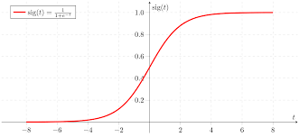

# Linear Models
- [Linear Models](#linear-models)
  - [Regression](#regression)
    - [Ordinary Least Squares (OLS, or Linear Regression)](#ordinary-least-squares-ols-or-linear-regression)
    - [Ridge regression (or Tikhonov, or L2 regularization)](#ridge-regression-or-tikhonov-or-l2-regularization)
    - [Least Absolute Shrinkage and Selection Operator (Lasso, or L1 regularization)](#least-absolute-shrinkage-and-selection-operator-lasso-or-l1-regularization)
    - [ElasticNet](#elasticnet)
  - [Binary classification](#binary-classification)
    - [OLS, Ridge and Lasso](#ols-ridge-and-lasso)
    - [Logistic regression](#logistic-regression)
  - [Multi-class classification](#multi-class-classification)
  - [Extra: Polynomial regression](#extra-polynomial-regression)

Linear models are powerful in high-dimensional problems, because hyperplanes can separete dimensions pretty well, under the assumption that dimensions are meaningful/informative.

It is easier to start the Linear Models with regression, because classification uses the same concepts. 

## Regression

Assume a **dataset** $(X, Y)$ with $n$ observations and $m$ features. If we have $m \leq n$, then linear models could fully map the dataset. Why? Because linear models model the dataset as a system of linear equations whose solution could be exact. Otherwise, if $m > n$, we settle for approximating the solution (i.e., finding the the best fit) by minimizing a given _loss_.

The equations look as follow:

$y_i = w_0 + w_1 \cdot x_{i2} + w_2 \cdot x_{i2} + ... + w_m \cdot x_{im} + e_i$.

$e_i$ is known as _noise_ or _error_. $w_0$ (the intercept) is not related to the original features, but creates a new one with all values set to 1. For simplicity, the linear system is modeled with matrices: $X$ the matrix of (modified) data with shape $n \times (m+1)$, $Y$ the matrix of target values with shape $n \times 1$, $W$ the matrix of weights with shape $(m + 1) \times 1$, and $Z$ the matrix of errors with shape $n \times 1$.

In linear models, what we call "_learning_" is simply solving the system $Y = X \cdot W$ to estimate the weights (a.k.a. coefficients) that parametrize the data. Note that $Z$ is not included in the system because it will account for the error (if any) that the approximation is unable to capture. We will revisit the most popular methods next.

<!-- > Typically, linear models will add an extra feature with all values set to 1, resulting in $m + 1$ features. Its associated coefficient will be $w_{m+1}$, which represents the intercept of the hyperplane. For simplicity, we will not consider it here. -->

### Ordinary Least Squares (OLS, or Linear Regression)

Least squares is simple. It fits $W = (X^T · X)^{-1} · X^T · Y$; where all elements are matrices; $^T$ and $^{-1}$ are the transpose and invert operators, respectively. The expression is the unique solution that comes from minimizing the objective function (a.k.a. _loss function_):

$L = \sum_{i=1}^{n} (y_i - x_i \cdot W)^2 = \left\Vert\ Y - X \cdot W \right\Vert_{2}^{2}$. 

This is, minimizing the difference between the actual target value and the prediction.

### Ridge regression (or Tikhonov, or L2 regularization)

The main "problem" with OLS is that it overfits the dataset. Also, OLS is not defined when $m > n$. Ridge regression attempts to solve this by adding a penalization term $\lambda \in [0, 1]$ for the weights, with the next objective function:

$L = \left\Vert\ Y - X \cdot W \right\Vert_{2}^{2} + \lambda \left\Vert W \right\Vert_{2}^{2}$

The penalization ensures smaller weights than OLS. A value $\lambda = 0$ is no regularization; i.e., OLS. On the contrary, $\lambda = 1$ is full regularization, which will cause the coefficients to move towards zero as, intuitively, in order to minimize $L$ small weights are prefered.

The unique solution is now: $W = (X^T \cdot X + λI)^{-1} \cdot X^T \cdot Y$; where $I$ is the identity matrix.

### Least Absolute Shrinkage and Selection Operator (Lasso, or L1 regularization)

Lasso simply tries a different penalization than the one used by Ridge. It uses the norm-1 but still uses $\lambda$. The new loss is now:

$L = \Vert\ Y - X \cdot W \Vert_{2}^{2} + \lambda \left\Vert W \right\Vert_{1}$

One of the most important implications of this change is that some coefficients will be zero. You can reason about this if you think of a two-dimensional plane and graph the absolute value function (that is the norm-1). Because of the latter, Lasso can be seen as a instrinsical feature selector.

> **Note**. scikit-learn uses a slightly different objective function, shrinking the first term by a factor of $2n$: $L = \frac{1}{2n} \Vert\ Y - X \cdot W \Vert_{2}^{2} + \lambda \left\Vert W \right\Vert_{1}$

L1 is preferred over L2 when we assume that few features are important.

### ElasticNet

It is a trade-off between L1 and L2. It redefines the objective function as:

$L = \Vert\ Y - X \cdot W \Vert_{2}^{2} + \lambda_2 \left\Vert W \right\Vert_{2}^{2} + \lambda_1 \left\Vert W \right\Vert_{1}$.

> **Note**: scikit-learn uses a slightly different loss. $L = \frac{1}{2n} \Vert\ Y - X \cdot W \Vert_{2}^{2} + \lambda \rho \left\Vert W \right\Vert_{1} + 0.5 \lambda (1 - \rho) \left\Vert W \right\Vert_{2}^{2}$; where $\rho$ is the trade-off parameter.

## Binary classification

### OLS, Ridge and Lasso

The binary classification utilizes the same method than regression, except that it adds a "trick". The $Y$ matrix of target values is filled with values in $\{-1, +1\}$, representing the binary class of every $x_i$. The method will then continue as we saw before to estimate the W matrix.

In the end the predicted class $\hat{y_{j}}$ for a new observation $x_j$ is as follows: if $\hat{y_{j}} \geq 0$, then the class is $+1$; if $\hat{y_{j}} < 0$, then the class is $-1$.

> The latter is an example of a _decision function_; i.e., the function that labels an observation.

### Logistic regression

Consider now binary classes in $\{0, 1\}$. Logistic regression follows a different approach to determine the class of each observation. It still assumes a linear form of the data, but the prediction is guessed using a _probability function_, that in this case is the _logistic function_:

$\Pr[y_i = 1 | x_i = x_{i1}, ... , x_{im}] = \frac{1}{1 + \exp(-(w_0 + w_1 \cdot x_{i1} + w_2 \cdot x_{i2} + ... + w_m \cdot x_{im}))}$

> Complementarly, $\Pr[y_i = 0 | x_i =  x_{i1}, ... , x_{im}] = 1- \Pr[1 | x_i = x_{i1}, ... , x_{im}]$

In other words, the **target value** of the observations is drawn form a logistic curve, such as the one below. 

> Keep in mind that this is the graph of the probability function, but the model models the data linearly (exponent of $e$).

The parameters $W$ are found maximizing the objective function known as Maximim Likelihood, typically using an approach called iterative re-weighted LS. The Maximim Likelihood is defined as:

$L = \sum_{i=1}^{n} \left[(1 - y_i)\log\left(\Pr[y_i = 0 | x_i = x_{i1}, ... , x_{im}]\right) + y_i\log(\Pr[y_i = 1 | x_i = x_{i1}, ... , x_{im}])\right]$

> Consider $L$. Since the classes $y_i$ are binary ($\{0, 1\}$), either the left or the right summand gets cancelled. Then Maximum Likelihood indeed optimizes the coefficients for the highest (maximum) possible probability.

## Multi-class classification

All the classification models above can handle binary classification only. To allow for multi-class classification a common approach is the _one vs. the rest_ competition:
- Create a binary model per class. For instance, if there are 3 classes, then create binary models for $c_1$ vs. $c_2$ (competition 1), $c_1$ vs. $c_3$ (competition 2), and $c_2$ vs. $c_3$ (competition 3).
- For each observation $x_i$, store the output of each competion in a vector $r_i$.
- The class of the highest probability (e.g. Logistic Regression) or decision function (e.g. OLS, Ridge, Lasso) in $r_i$ wins.

## Extra: Polynomial regression

In polynomial regression, a polynomial model on each $x_i$ is assumed. The equations look as follow:

$y_i = w_0 + w_1 \cdot x_{i2} + w_2 \cdot x^2_{i2} + ... + w_m \cdot x^m_{im} + e_i$.

Since the coeffiecents are still linear and the only change is in $X$, all methods we saw before still apply.

