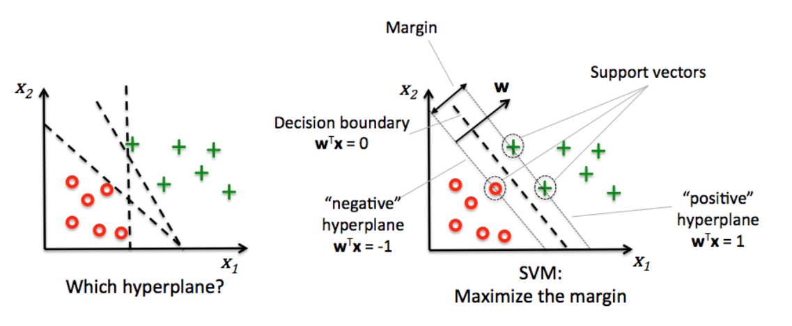
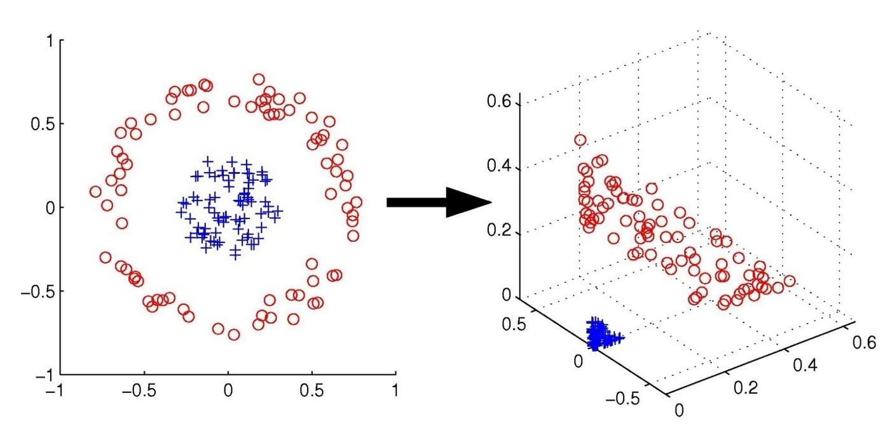

# Support-Vector Machines (SVMs)

- [Support-Vector Machines (SVMs)](#support-vector-machines-svms)
  - [Binary classification](#binary-classification)
    - [Linearly-separable data (hard-margin SVMs)](#linearly-separable-data-hard-margin-svms)
      - [Training](#training)
      - [Prediction](#prediction)
    - [Not linearly separable data (soft-margin SVMS)](#not-linearly-separable-data-soft-margin-svms)
    - [Kernelized SVMs](#kernelized-svms)
      - [Mapping the input space to a higher one](#mapping-the-input-space-to-a-higher-one)
      - [The kernel trick](#the-kernel-trick)
      - [Examples of kernels for SVMs](#examples-of-kernels-for-svms)
        - [Linear kernel](#linear-kernel)
        - [Polynomial kernel](#polynomial-kernel)
        - [Radial Gaussian kernel (RBF)](#radial-gaussian-kernel-rbf)
  - [Multi-class classification](#multi-class-classification)
  - [Regression](#regression)

## Binary classification

We will assume that classes are in the set $\{-1, 1\}$.

### Linearly-separable data (hard-margin SVMs)

SVMs work for both classification and regression but they are most powerful for the former. The purpose of a SVM is to find the function (e.g. hyperplane) that separates the two classes. If data is linearly separable, then it is possible to perfectly identify regions. Such regions have boundaries defined by some of the data points. The idea of a SVM is to use those data points as _support vectors_ to parameterize an hyperplane that lies in the middle of the gap between regions.
The one condition that the hyperplane must satisfy is that the gap (known as _margin_) must be the biggest possible. An example of candidate hyperplanes for a 2D dataset is shown in the left image below.

| Left: different candidates. Right: Elements of the SVM problem          |
|:-----------------------------------------------------------------------:|
|  |

<!-- Visually, finding candidates seems pretty straightforward but, computationally, SVMs have to find the candidates using the data points as pivots.  -->

#### Training

A linear SVM is simply an hyperplane $\textbf{SVM} = W \cdot X + b$. The components of $W$ are obtained by maximizing the function $\frac{2}{ \left\Vert W \right\Vert }$ (i.e., the margin) **under the constraint that all data points are classified correctly**: $y_i(W \cdot x_i + b) \geq 1, \forall x_i \in X$.

The problem is equivalent to minimizing $\frac{1}{2} \left\Vert W \right\Vert^{2}$ under the same constraints. This minimization problem is solved by using the _Lagrangian multiplier method_, resulting in the following formulation:

$\min \sum_{i=1}^{n} \alpha_i + - \frac{1}{2} \sum_{i=1}^{n}\sum_{j = 1}^{n}\alpha_i \alpha_j y_i y_j(x_i \cdot x_j)$

s.t. $\alpha_i \geq 0$; $\sum_{i=1}^{n} \alpha_i y_i = 0$

The unkown variables above are the alphas. The problem is then finding the scalars $\alpha_i$ associated to each data point, which will determine the direction of the vector associated to the hyperplane: 

$W = \sum_{i=1}^{n} \alpha_i y_i x_i$.

> The optimization problem can be solved with _quadratic programming_, for instance with the _sequential minimal optimization_ approach.

While finding the coefficients, many $\alpha_i$ will become $0$, which will not contribute to the vector W. Those $\alpha_i \neq 0$ are the _support vectors_.

The intercept $b$ can be found with a simple substraction for any $i$ whose $\alpha_i \neq 0$ (i.e., a support vector): 

$b =  y_i - W \cdot x_i$

#### Prediction

Since we have a paramter vector $W$ that represents the hyperplane, then we can classify a new point $u$ by looking at the sign of:

$f(u) = W \cdot u +b$ = $\sum_{i=1}^{l} \alpha_i y_i x_i \cdot u + b$

### Not linearly separable data (soft-margin SVMS)

Most of the time in real life, data is not linearly separable and we have to settle for an approximation. In this new setting, we still want an hyperplane $\textbf{SVM} = W \cdot X + b$. However, we have to make a relaxation on the constraint that all data points must be classified correctly, so that now: $y_i(W \cdot x_i + b) \geq 1 + \xi_i, \forall x_i \in X$, and $\xi_i \geq 0, \forall i$.

> Equivalently, the constraint is $1 - \xi_i - y_i(W \cdot x_i + b) \leq 0$.

> The $\xi_i$ variables are known as _slack_ variables.

The relaxation implies to allow some missclassifications. We want a minumum number of missclassifications, so in the optimization stage we have now a new penalty term associated to the slack variables: $\frac{1}{2} \left\Vert W \right\Vert^{2} + C \sum_{i=0}^{n}\xi_i$. With this formulation, we are optimizing the hyperplane and keeping the missclassifications to a minimum.

Again, this can be solved using the _Lagrangian multiplier method_, resulting in a new formulation:

$\min \sum_{i=1}^{n} \alpha_i + - \frac{1}{2} \sum_{i=1}^{n}\sum_{j = 1}^{n}\alpha_i \alpha_j y_i y_j(x_i \cdot x_j)$

s.t. $0 \leq \alpha_i \leq C, \forall i$; and $\sum_{i=1}^{n} \alpha_i y_i = 0$

**To understand C think of the extreme cases. If $C=0$, then there are no slack terms. If $C$ is small (e.g., 0.01, 0.1, or 1), then slack variables do not count much and the penalization for missclassification is not too relevant. If $C$ is big (e.g., 100, 1000, etc), then the penalization for missclassification is very strong.**

> The parameter $C$ is an example of regularization. A regularizer allows us to play with the strictness of the model. A strict model tends to overtift the data. A less-strict model tends to underfit. In the case of $C$, when it is small the model is less strict, allowing more errors. On the contrary, if $C$ is large, the model is strict, complex and intolerant to errors.

### Kernelized SVMs 

#### Mapping the input space to a higher one

The theory above works well for (close to) linearly separable data. However, sometimes data has much more complex shapes and linear classifiers are not an option. An alternative is to map the dataset into a higher dimension, hoping for the dataset to become linearly separable in the new space. An example of a transformation is in the image below.

Formally, this transformation is a function $\phi$ known as **feature map**, defined as $\phi: X \mapsto \mathcal{H}$. The new space $\mathcal{H}$ is called the _feature space_ and it typically is of a higher dimension than $X$.

In the image above, $X_{\text{e.g.}}$ is a dataset of two features, so that each observetion $x_i = (x_{i1}, x_{i2})$. The feature map is $\phi_{\text{e.g.}}(x_i) = (x_{i1}^2, x_{i2}^2, \sqrt{2}x_{i1}x_{i2})$. 

We can apply any feature map $\phi$ to the whole dataset $X$ and apply a soft-margin SVM, ending up in the next minimization problem:

$\min \sum_{i=1}^{n} \alpha_i + - \frac{1}{2} \sum_{i=1}^{n}\sum_{j = 1}^{n}\alpha_i \alpha_j y_i y_j(\phi(x_i) \cdot \phi(x_j))$

Note that the only difference with the formulation derived in the [previous section](#not-linearly-separable-data-soft-margin-svms) is the dot product $\phi(x_i) \cdot \phi(x_j)$. The rest of the problem remains the same because we still want to use a linear model, but with a transformed dataset.

#### The kernel trick

Applying a feature map can be computationally expensive but, fortunatelly, it can be shortened with the so-called **kernel trick**. The kernel trick is a sort of "shortcut" to compute the inner product $\phi(x_i) \cdot \phi(x_j)$ in a cheaper way. There are two elements involved in it:
-  **A _feature map_ $\phi$**.
- **A kernel $k$**. A similarity function $k: X \times X \mapsto \mathbb{R}$ satisfying simmetry: $k(x_i,x_j) = k(x_j,x_i) \,\,\, \forall x_i,x_j \in X$.

> More strictly, the space $\mathcal{H}$ in the kernel trick is a [Hilbert space](https://en.wikipedia.org/wiki/Hilbert_space), where the inner product is defined and all operations are meaningful. The kernel must yield a _kernel matrix_ $K \in \mathbb{R}^{n \times n}$ where $K_{ij} = k(x_i, x_j)$ that is [positive-definite](https://en.wikipedia.org/wiki/Definiteness_of_a_matrix).

The actual trick is simply to find a $k$ and a $\phi$ that satisfy the next relation: $\phi(x_i) \cdot \phi(x_j) = k(x_i, x_j)$. In order to have an improvement, $k$ has to be computationally cheaper than $\phi$. The minimization problem of SVMs with kernel becomes:

$\min \sum_{i=1}^{n} \alpha_i + - \frac{1}{2} \sum_{i=1}^{n}\sum_{j = 1}^{n}\alpha_i \alpha_j y_i y_j k(x_i, x_j)$

s.t. $0 \leq \alpha_i \leq C, \forall i$; and $\sum_{i=1}^{n} \alpha_i y_i = 0$

If we find a suitable $k$, then we do not need to perform operations on the space $\mathcal{H}$ but we can stay in the original $X$. Hopefully, the next section will illustrate this benefit better.

#### Examples of kernels for SVMs

Let's remember that a condition for a valid kernel is for it to be a symmetric operation. The inner product is simple, cheap, and complies with the requirement, thus it is very common to find kernels that rely on it.  Let's consider again the dataset and the feature map we used as example before: $\phi_{\text{e.g.}}(x_i) = (x_{i1}^2, x_{i2}^2, \sqrt{2}x_{i1}x_{i2})$, with $x_i \in X_{\text{e.g.}}$.

The inner product $\phi(x_i) \cdot \phi(x_j)$ is then as follows:

$
\phi(x_i) \cdot \phi(x_j) = (x_{i1}^2, x_{i2}^2, \sqrt{2}x_{i1}x_{i2}) \cdot (x_{j1}^2, x_{j2}^2, \sqrt{2}x_{j1}x_{j2}) =
x_{i1}^2 x_{j1}^2 + x_{i2}^2x_{j2}^2 + 2 x_{i1}x_{i2} x_{j1}x_{j2}
$

This is equivalent to a simple inner product between $x_i$ and $x_j$, with the advantage of not applying any transformation whatsoever:

$
k_{\text{e.g.}}(x_i, x_j) = (x_i \cdot x_j)^2 = (x_{i1} x_{j1} + x_{i2} x_{j2})^2 =
x_{i1}^2 x_{j1}^2 + x_{i2}^2x_{j2}^2 + 2 x_{i1}x_{i2} x_{j1}x_{j2}
$

With $k_{\text{e.g.}}$ we are obtaining the same result as if we had applied $\phi_{\text{e.g.}}(X_{\text{e.g.}})$, with the main advantage of never computing the _feature space_ $\mathcal{H}_{\text{e.g.}}$. Of course, this feature map is hand-crafted, but the next kernels (availble in scikit-learn) can illustrate the benefits better.

##### Linear kernel

$k_{\text{l}}(x_i,x_j) = x_i \cdot x_j$

##### Polynomial kernel

Let $b \geq 0$ and $d \in \mathbb{N}$. The polynomial kernel is defined as:

$k_{\text{p}}(x_i,x_j) = (x_i \cdot x_j + b)^d$, 

##### Radial Gaussian kernel (RBF)
Let $\gamma \geq 0$. The RBF kernel is defined as

$k_{\text{rbf}}(x_i,x_j) = exp(-\gamma \left\Vert x_i - x_j \right\Vert^{2})$.

<!-- The **kernel trick** is to use a _kernel_ as a "sshortcut" of the _feature map_ by satisfying the next relation: $\phi(x_i) \cdot \phi(x_j) = k(x_i, x_j)$. The _trick_ is that the kernel allows us to map and compute the similarity in one step. -->

## Multi-class classification

It follows the one vs. the rest approach so that we come up with several hyperplanes (one per class). In the case of kernelized SVMs, the same kernel is used for all the hyperplanes.

## Regression

SVMs for regression aim to find the same hyperplane as in the classification setting. However, prediction happens with the same hyperplane we found.